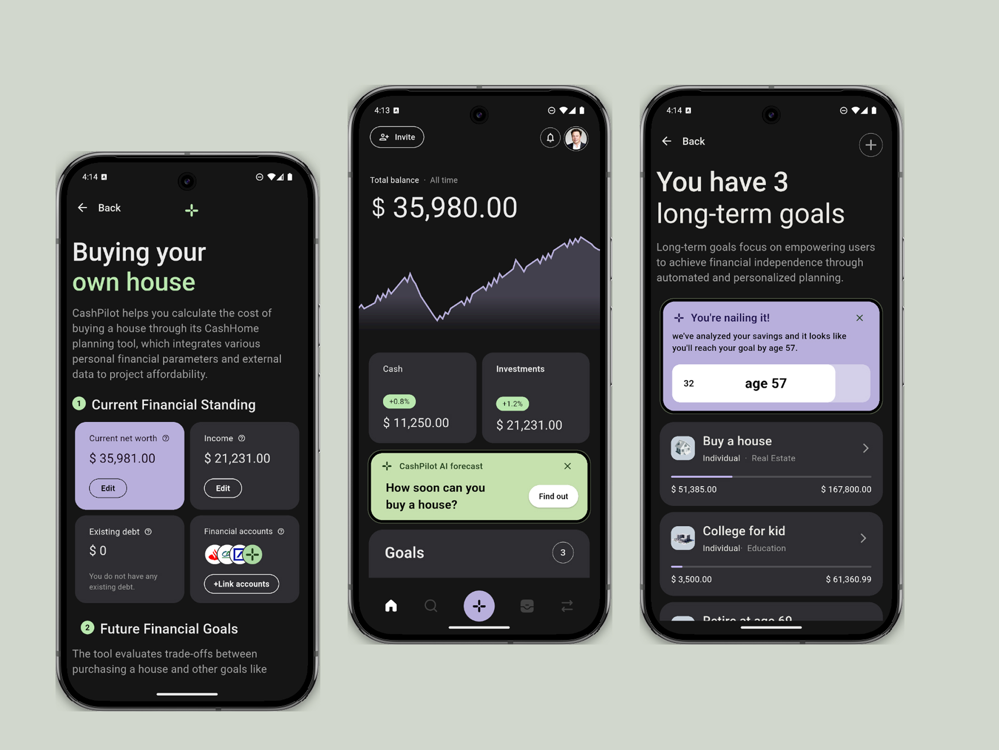

# FinTech Project 💸📊

A modern **FinTech mobile application UI** built with **Flutter** to help users manage personal finances in a clean, intuitive, and powerful way.

## ✨ Overview

This project presents a sleek and user-friendly financial dashboard experience where users can:

- Track total balance and portfolio growth
- Monitor cash and investment performance
- Manage short-term and long-term financial goals
- Analyze expenses and savings patterns
- Get AI-powered insights for better financial planning

The interface is designed with a premium dark theme, clear data hierarchy, and interactive cards/charts for a smooth user experience.

## 🖼️ UI Preview

## 🚀 Tech Stack

- **Flutter (Dart)** for cross-platform mobile UI
- Native platform support (Android/iOS)
- Chart-driven analytics components
- Modular and scalable project structure

## 🎯 Project Goal

To build a modern personal finance app experience that combines beautiful UI with practical financial tools—so users can make smarter money decisions with confidence.
